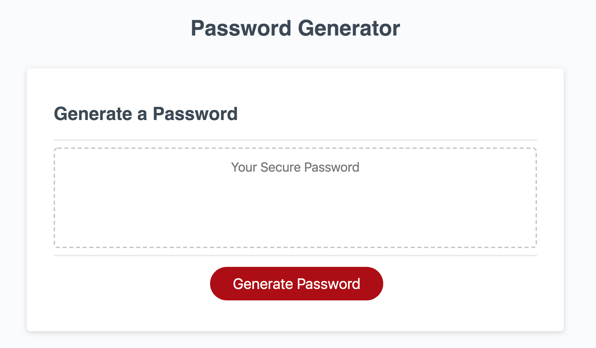
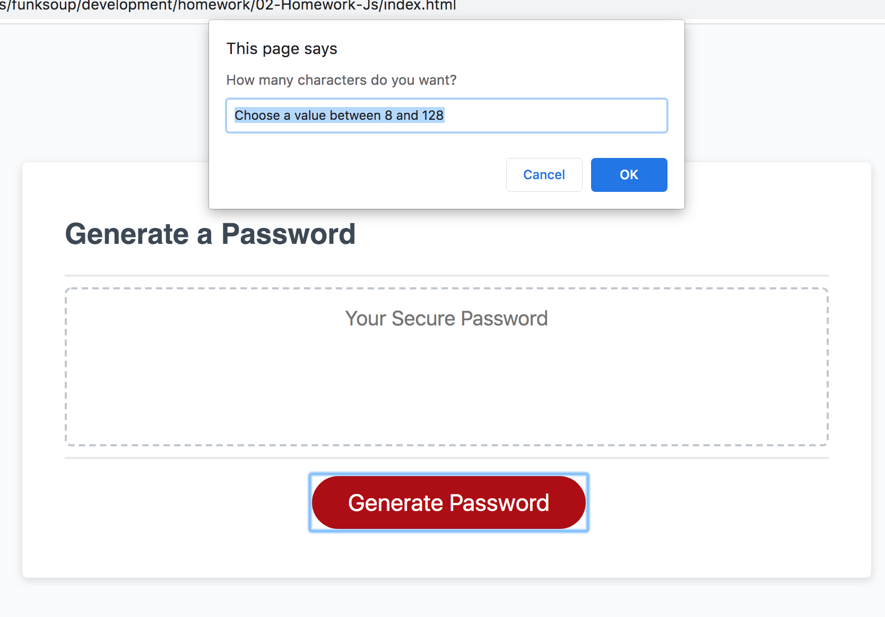
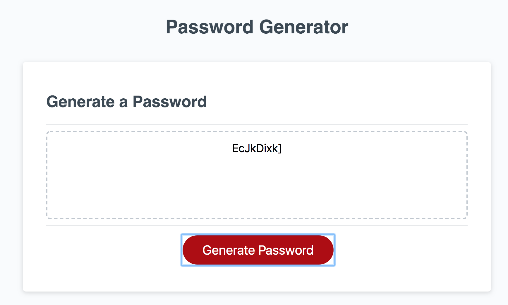

# Password Generator

Generates a random password based on user-selected criteria. By default, lowercase letters are included and the following can be added:
* uppercase letters
* numbers
* special characters (such as `~!#$%^&*+=-[]\\\';,/{}|\":<>?`)

Runs in the browser and features dynamically updated HTML and CSS. 

## Tech/Framework Used

Project is created with JavaScript

## Usage

The following images demonstrate the application functionality:

## Contributing

Pull requests are welcome. For major changes, please open an issue first to discuss what you would like to change.

### Step 1

* Option 1:🍴 Fork this repo!

* Option 2: 👯 Clone this repo to your local machine using https://github.com/funksoup/02-Homework-Js.git

### Step 2

* HACK AWAY! 🔨🔨🔨

### Step 3

* 🔃 Create a new pull request using https://github.com/funksoup/02-Homework-Js/compare 

